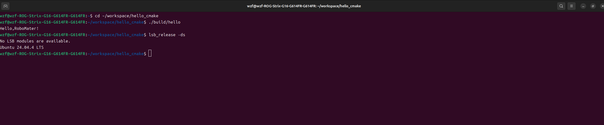

# Hello CMake
## 项目简介
输出 Hello, RoboMaster!
## 环境信息
- Ubuntu 24.04.4 LTS
- GCC 13+
- CMake 3.28+
## 目录结构
- src/:源代码
- images/:README 截图
- build/:CMake 生成，不提交到 git
## 构建与运行
```bash
cmake -S . -B build
cmake --build build
./build/hello```

## 运行结果


## 作者
- 王子凡 2264215100 2026.9.19
- 备注：本机的cmake故障，故先用g++验证
